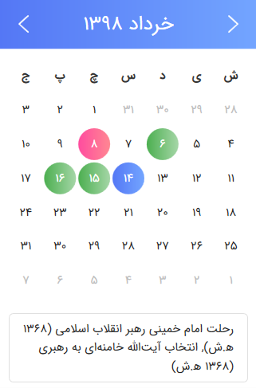
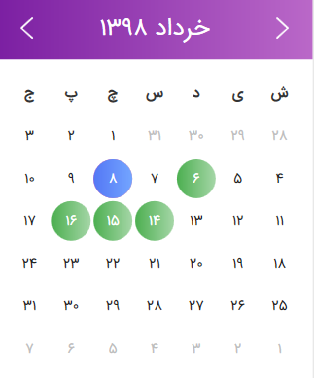
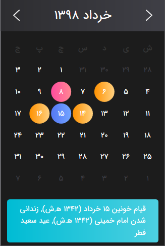
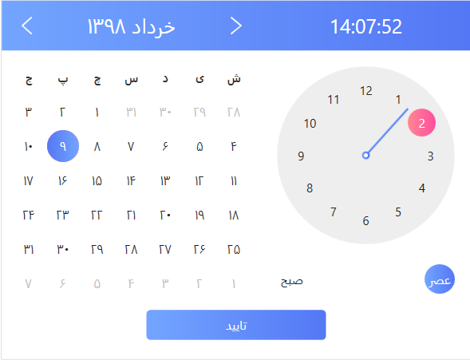

# <div dir="rtl">PersianToolkit</div>
<div dir="rtl">پرشین تولکیت شامل تقویم و انتخاب کننده تاریخ، بصورت شمسی بوده که توانایی نمایش روزهای تعطیل، و عنوان مناسبت های میلادی، قمری و شمسی را دارد. همچنین پرشین تولکیت شامل توابع قدرتمندی جهت تبدیل تاریخ بصورت شمسی، قمری، و میلادی است.</div>

 <br> <br>  


# <div dir="rtl">نحوه استفاده</div>

<div dir="rtl">ابتدا پرشین تولکیت را از ناگت نصب کنید</div>

```
Install-Package PersianToolkit
```

<div dir="rtl">منابع برنامه را در فایل App.xaml بارگزاری کنید</div>

```
<ResourceDictionary>
            <ResourceDictionary.MergedDictionaries>
                <ResourceDictionary>
                    <ResourceDictionary.MergedDictionaries>
                        <ResourceDictionary Source="pack://application:,,,/PersianToolkit;component/Themes/SkinDefault.xaml"/>
                        <ResourceDictionary Source="pack://application:,,,/PersianToolkit;component/Themes/Theme.xaml"/>
                    </ResourceDictionary.MergedDictionaries>
                </ResourceDictionary>
            </ResourceDictionary.MergedDictionaries>
</ResourceDictionary>
```

<div dir="rtl">در هر کجا که نیاز به تقویم دارید ابتدا فضای نام برنامه را فراخوانی کنید سپس از اجزای آن استفاده کنید</div>

``` 
xmlns:pc="http://github.com/ghost1372/PersianToolkit"
```


```c#
    <pc:Calendar/>
    <pc:DatePicker/>
```
##  <div dir="rtl">تغییر پوسته برنامه</div>

<div dir="rtl">پرشین تولکیت شامل 3 پوسته پیشفرض است که میتوانید به راحتی در زمان اجرا پوسته برنامه را تغییر دهید قبل از آن نیاز است تا تابع تغییر پوسته را پیاده سازی کنید</div>

```c#
internal void UpdateSkin(SkinType skin)
        {
            ResourceDictionary skins0 = Resources.MergedDictionaries[0];
            skins0.MergedDictionaries.Clear();
            skins0.MergedDictionaries.Add(ResourceHelper.GetSkin(skin));
            skins0.MergedDictionaries.Add(new ResourceDictionary
            {
                Source = new Uri("pack://application:,,,/PersianToolkit;component/Themes/Theme.xaml")
            });
            Current.MainWindow?.OnApplyTemplate();
        }
```

<div dir="rtl">ورودی تابع از نوع SkinType می باشد که شامل Dark, Violet و Defualt می باشد</div>

```UpdateSkin(SkinType.Violet)```

## <div dir="rtl">تغییر تقویم به حالت میلادی یا شمسی</div>

<div dir="rtl">برای تغییر نوع تقویم میتوانید از کلاس ConfigHelper استفاده کنید</div>

```c#
ConfigHelper.Instance.SetLanguage(ConfigHelper.Language.Persian);
```

<div dir="rtl">نکته: فقط یکبار آن هم در زمان شروع شدن برنامه میتوانید نوع تقویم را تغییر دهید در زمان اجرا نمیتوانید نوع تقویم را تغییر دهید</div>

## <div dir="rtl">گزینه های موجود</div>

### <div dir="rtl"> ShowHoliday :مناسبت ها</div>

<div dir="rtl">جهت نمایش مناسبت ها و روز های تعطیل روی تقویم میتوانید آن را فعال کنید قابل استفاده در تقویم و انتخاب کننده تاریخ</div>

```
<pc:Calendar pc:Holiday.ShowHoliday="True"/>
```

### <div dir="rtl">رنگ ها : روز جاری، روز انتخاب شده، روزهای تعطیل، کادر مناسبت ها</div>

<div dir="rtl">شما میتوانید براحتی رنگ روز فعلی، روز انتخاب شده و روزهای تعطیل را تغییر دهید</div>

```
<pc:Calendar pc:ColorStyle.HolidayDayBrush="{DynamicResource SuccessBrush}" pc:ColorStyle.SelectedDateBrush="{DynamicResource WarningBrush}" pc:ColorStyle.TodayDateBrush="{DynamicResource InfoBrush}"/>
```

<div dir="rtl">بصورت پیشفرض رنگ های زیر موجود است و با نوشتن آنها میتوانید از رنگ های پیشفرض استفاده کنید</div>


| PrimaryBrush     |
| :--------------- |
| **SuccessBrush** |
| **InfoBrush**    |
| **DangerBrush**  |
| **WarningBrush** |
| **AccentBrush**  |


<div dir="rtl">برای تغییر رنگ کادر عنوان مناسبت ها باید از پراپرتی HolidayContentStyle استفاده کنید دقت کنید که این پراپرتی ورودی از نوع Style برای کنترل Label دریافت می کند بصورت پیشفرض استایل های زیر موجود است</div>

```
<pc:Calendar pc:ColorStyle.HolidayContentStyle="{StaticResource LabelPrimary}"/>
```

| LabelDefault     |
| ---------------- |
| **LabelPrimary** |
| **LabelSuccess** |
| **LabelInfo**    |
| **LabelDanger**  |
| **LabelWarning** |


## <div dir="rtl">تغییر رنگ ها و استایل به وسیله کدهای سی شارپ</div>

<div dir="rtl">شما میتوانید رنگ ها و استایل های موجود را  با سی شارپ هم تغییر دهید برای این منظور وارد کلاس ColorStyle شوید و پراپرتی موردنظر را انتخاب کنید و مقدار دلخواه را ست کنید، برای سادگی کار استایل ها و رنگ های پیشفرض توسط کلاس ResourceHelper و ResourceBrushToken یا ResourceHolidayContentStyleToken قابل دسترسی هستند.</div>

```c#
ColorStyle.SetHolidayDayBrush(pc, ResourceHelper.GetResource<Brush>(ResourceBrushToken.SuccessBrush));

ColorStyle.SetHolidayContentStyle(pc, ResourceHelper.GetResource<Style>(ResourceHolidayContentStyleToken.LabelPrimary));

```

